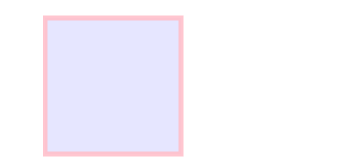

# This is Markdown Syntax


Ordered Lists ...
1. this is one
2. this is two
	1. this is two one
	2. this is two two
3. this is three	

Unordered Lists ...
* Cat
* Dog
  * big dog
  * little dog
* Fish

- Red
  - light red
  - dark red
- Green
- Blue

Horizontal line ...

---

#### Anchor Link: 
[Click this Anchor in this page](#my-anchor)

#### Relative Link: 
[Click this link for another .md page](md-subdir/another.md)

#### Directory Link: 
[Click this link for subdir](md-subdir/)
 
#### External Link
[Click this link](http://www.qualified.io)
 
#### Relative Location of Image


#### External location of image 
 
 
 
First Column Header  | Second Header
------------- | -------------
Content Cell goes here  | Content Cell
Content Cell  | Content Cell


| First Header  | Second Header |
| ------------- | ------------- |
| Content Cell  | Content Cell  |
| Content Cell  | Content Cell  | 


|Indx|Data|
|---:|:------|
|  0 | hello|
|  1 | hello|
|  2 | 3 |
|  3 | 3 |
|  4 | 1.5 |


# The largest heading = header 1
## The second largest heading = header 2
###### The 6th largest heading = header 6


**bold**  *italic*  ~~strikethrough~~   ***bold & italic***

*This text will be italic* so will _this_
**This text will be bold** as will __that__

Code Syntax ...

`python -m venv venv`


``` python
	print('hello world')
```

```
{
  "firstName": "John",
  "lastName": "Smith",
  "age": 25
}
```


This is a blockquote ...

> Everyday life is like programming, I guess.
> If you love something you can put beauty into it.
> - Donald Knuth


<a name="my-anchor"></a>
# my-anchor
